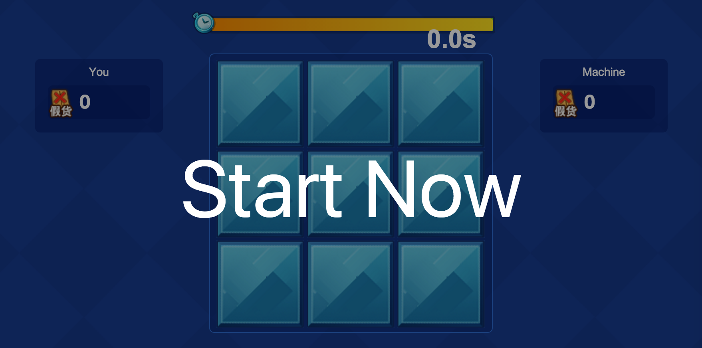

# whac-a-logo
like Whac-A-Mole game —— 打假图标游戏，IE浏览器JS动画，高级浏览器CSS动画，类似打地鼠，与电脑挑战，打击假图标多者获胜。

###options###
```html
gameTime: 20, // 游戏时长s
turnNum: 3, // 初始自动翻面商标数
turnTime: 4000, // 商标自动翻面时长
wrongTime: 1000, // 敲错减少游戏时间数
logoAddInter: 8000, // 增加一个翻面logo的间隔
wrongNum: 1, // 翻面LOGO的错误数
hitInter: 400, // 玩家连续敲击间隔，至少大于 hHitTime
ohitRating: 0.9, // 机器人命中率
oMinHitTime: 1000 // 机器人 最小反应时间
```
###snapshot###


###demo###
See [css3 version](http://imwr.github.io/whac-a-logo/mindex.html)
Or
See [pc version](http://imwr.github.io/whac-a-logo)

<!--
###demo###
See [css3 version](http://tt-cc.cn/front-end/jquery-game/hiticon-css)
Or
See [pc version](http://tt-cc.cn/front-end/jquery-game/hiticon)
-->